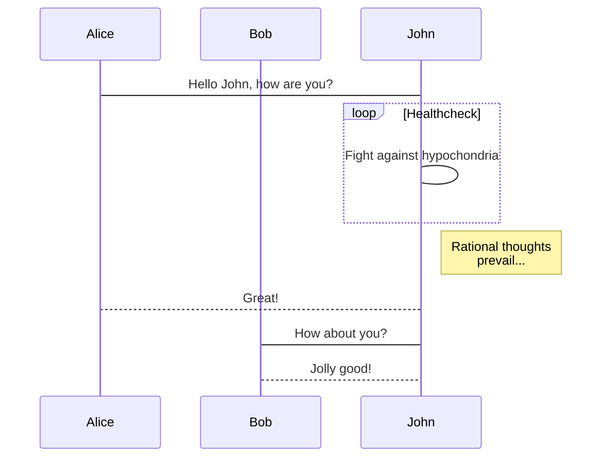

# 欢迎使用 iOS 版 MWeb

MWeb 是专业的 Markdown 写作、记笔记、静态博客生成软件，目前已支持 Mac，iPad 和 iPhone。MWeb 所使用的 Markdown 语法为 Github Flavored Markdown，简称 GFM，这是一种最为广泛使用的 Markdown 语法之一。如果你不知道什么是 Markdown，建议看一下附带的 [Markdown 语法官方说明](Markdown%20Syntax.md) 文档。GFM 除了支持官方的语法外，还扩展了不少语法。


## GFM 语法简介和 MWeb 所支持的扩展语法

### 回车转为换行

官方的语法规定结尾加 2 个以上空格加换行才会转成换行，也就是 `<br />` 标签。MWeb 中有个选项可以直接把换行转成 `<br />`，不用加上 2 个以上空格，这个选项默认是开启的。如果要关闭，请在设置页面关闭。

### 任务列表（Task lists）

Markdown 语法：

```
- [ ] 任务一 未做任务 `- + 空格 + [ ]`
- [x] 任务二 已做任务 `- + 空格 + [x]`
```

效果如下：

- [ ] 任务一 未做任务 `- + 空格 + [ ]`
- [x] 任务二 已做任务 `- + 空格 + [x]`

### 图片大小及对齐

官方和 GFM 都不支持图片大小控制及对齐设置，MWeb 引入的特别的语法来设置图片宽度和居左、居右、居中。如：`` 这样表示设置图片宽度为 450。其中 -w450 为设置语法，生成 HTML 时会自动移除。w 表示设置宽度，居左为：-l400，居右为 -r400，居中为 -c400，比如设置一图片宽度为 500 并居中：``。 可以看出，MWeb 引入的语法的特点是兼容原来的语法和仅支持设置宽度。

### 多行或者一段代码

Markdown 语法：

	```js
	function fancyAlert(arg) {
	  if(arg) {
	    $.facebox({div:'#foo'})
	  }

	}
	```
	
效果如下：

```js
function fancyAlert(arg) {
	if(arg) {
		$.facebox({div:'#foo'})
	}

}
```

这个语法目前在 MWeb 中使用，必须前后空一行，才会正确解析。我觉得，在写 Markdown 文档过程中，运用空行很有必要，基本上，块级元素（标题、列表、引用、代码块、表格、段落等），都建议前后空一行。

### 表格

Markdown 语法：

```
第一格表头 | 第二格表头
--------- | -------------
内容单元格 第一列第一格 | 内容单元格第二列第一格
内容单元格 第一列第二格 多加文字 | 内容单元格第二列第二格
```

效果如下：

第一格表头 | 第二格表头
--------- | -------------
内容单元格 第一列第一格 | 内容单元格第二列第一格
内容单元格 第一列第二格 多加文字 | 内容单元格第二列第二格


### 删除线

Markdown 语法：

	加删除线像这样用： ~~删除这些~~

效果如下：

加删除线像这样用： ~~删除这些~~

### LaTeX

Markdown 语法：

	块级公式：
	```math
	x = \dfrac{-b \pm \sqrt{b^2 - 4ac}}{2a}
	```

	行内公式： ``\Gamma(n) = (n-1)!\quad\forall n\in\mathbb N``


效果如下（在设置页面中启用 LaTeX 才会看到效果）：

块级公式：

```math
x = \dfrac{-b \pm \sqrt{b^2 - 4ac}}{2a}
```

行内公式： ``\Gamma(n) = (n-1)!\quad\forall n\in\mathbb N``

注意：为了兼容 MWeb 3，也支持 $\Gamma(n) = (n-1)!\quad\forall n\in\mathbb N$ 
和块级语法
$$	x = \dfrac{-b \pm \sqrt{b^2 - 4ac}}{2a} $$
但是建议用新的语法。

## MWeb 画图

### mermaid

mermaid 是比较流行的画图库，它支持流程图、顺序图和甘特图，它的官网为：<https://mermaidjs.github.io/> ，在 MWeb 中使用 mermaid 的语法就是声明代码块的语言为 mermaid，代码块中再写上 mermaid 的画图语法即可，你可以把下面的语法复制到 MWeb 中查看效果。

    ```mermaid
    sequenceDiagram
        participant Alice
        participant Bob
        Alice->John: Hello John, how are you?
        loop Healthcheck
            John->John: Fight against hypochondria
        end
        Note right of John: Rational thoughts <br/>prevail...
        John-->Alice: Great!
        John->Bob: How about you?
        Bob-->John: Jolly good!
    ```
 
**效果如下：**
 

### echarts

echarts 是百度出品的 js 画图库，它的网址为：<https://echarts.apache.org/zh/index.html>，功能非常强大，MWeb 支持 echarts 的一些基本的用法，太高级的不支持。你可以将以下语法复制到 MWeb 中进行尝试。你也可以去 <https://echarts.apache.org/examples/zh/index.html> 这个网址查看一些例子，要注意的是 MWeb 只能解析 `option = {}` 这种简单的，不过应该是足够使用了。

    ```echarts
    option = {
        xAxis: {
            type: 'category',
            data: ['Mon', 'Tue', 'Wed', 'Thu', 'Fri', 'Sat', 'Sun']
        },
        yAxis: {
            type: 'value'
        },
        series: [{
            data: [820, 932, 901, 934, 1290, 1330, 1320],
            type: 'line'
        }]
    };
    ```

**效果如下：**

```echarts
option = {
    xAxis: {
        type: 'category',
        data: ['Mon', 'Tue', 'Wed', 'Thu', 'Fri', 'Sat', 'Sun']
    },
    yAxis: {
        type: 'value'
    },
    series: [{
        data: [820, 932, 901, 934, 1290, 1330, 1320],
        type: 'line'
    }]
};
```


### 脚注（Footnote）

Markdown 语法：

```
这是一个脚注：[^1]
```

效果如下：

这是一个脚注：[^1]

[^1]: 这里是脚注信息


### 注释和阅读更多

<!-- comment -->
<!-- more -->

**注** 阅读更多的功能只用在文档库生成静态网站或发布到 Wordpress 博客时，插入时注意要后空一行。


